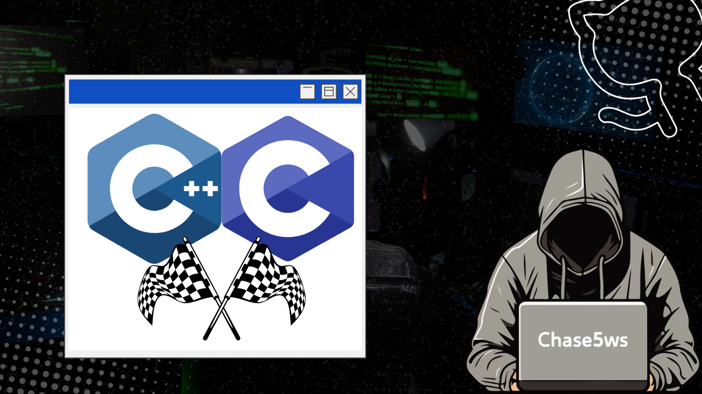

# C_geeksforgeeks

---

## 專案說明

**C_geeksforgeeks**  
這是一個基於 C/C++ 撰寫的「geeksforgeeks」競賽學習專案，通過競賽題目快速學習 C/C++ 基本語言。

---

## 使用情境

- 學習者可以通過本專案快速掌握 C/C++ 基礎語法。
- 適用於競賽訓練，通過題目挑戰提升編程能力。
- 適合學習與測試 AI 演算法、回溯演算法等。

---

## Ai assignment - 搜索代理人

- **目標:**  
  透過座標進行判斷，執行移動操作來蒐集資源。起始時，球的速度為0，半徑為20，並且半徑會隨著資源增長並與速度成反比。操作包括上下左右共四個方向的八個選項，以及無操作。操作時間不能超過50毫秒，超過則視為無操作。

- **搜索策略:**  
  使用座標系統來判斷每次執行的動作，延長某個方向上的移動時間，避免原地打轉，提升資源蒐集效率。

- **設計理念:**  
  增加移動效率和方向上的時間，讓代理人能夠有效的執行搜尋任務，進行資源蒐集。

- **挑戰:**  
  對於一名沒有修過基礎程式二的學生來說，演算法與 C 語言的應用是十分陌生的，所以一開始沒有頭緒。經過學長姊的指導，花了大量時間才完成這個讓我感到壓力的作業。

---

## Data structure - LinkedList

- **目標:**  
  這個LinkedList實作展示了如何創建和管理單向鏈表。實作中包含了基本的操作，例如：在列表開頭和尾部插入節點、刪除節點、列印列表內容、反轉鏈表和清空鏈表等。

- **實作策略:**  
  使用C++的類和指標來實現LinkedList。每個節點（`ListNode`）包含數據字段（`data`）和指向下一個節點的指標（`next`）。`LinkedList`類別提供了對鏈表的各種操作，如插入、刪除、反轉等。

- **設計理念:**  
  利用指標來實現動態資料結構，靈活地管理內存和操作。鏈表支持快速的插入和刪除，特別適用於資料需要頻繁變動的情況。

- **挑戰:**  
  在設計過程中，最具挑戰的部分是處理指標操作，尤其是對於刪除節點和反轉鏈表的操作，這需要非常謹慎地管理指標，以避免內存泄漏和程式崩潰。

---

## 競賽題目

- **AtoM - 轉換一維與二維陣列**  
  描述了如何將一維陣列與二維陣列之間進行轉換，並支持多種矩陣形式的轉換。

- **Submatrix - 矩陣子矩陣**  
  該問題需要從矩陣中提取指定範圍的子矩陣。

- **DisconnectedSet - 最大不連通集**  
  介紹了數字理論中的最大不連通集問題，並使用尾遞歸方法進行求解。

- **HammingDistance - 哈明距離**  
  計算兩個二進位模式的哈明距離並列舉所有可能的二進位模式。

- **MovingBalls - 擴展漢諾塔問題**  
  將漢諾塔問題擴展至多個柱子和球的情況，並根據條件將球放置在不同的柱子上。

- **Echo Server - 回音伺服器**  
  實現一個回音伺服器，支持回音和反向回音兩種模式。

- **GCD and LCM - 最大公約數與最小公倍數**  
  透過歐幾里得算法計算兩數的最大公約數（GCD）與最小公倍數（LCM）。

- **Hanoi - 漢諾塔問題**  
  解決基本的漢諾塔問題並展示每步驟。

- **Acceleration - 加速度與位移**  
  根據物理學公式計算物體在不同時間下的位移。

- **Trigonometric - 直角三角形判斷**  
  判斷一個三角形是否為直角三角形。

- **CopyAndPaste - 複製與粘貼**  
  計算達到 n 次複製所需的複製次數。

- **Attacker - 魔法風雲會攻擊者與防禦者差值計算**  
  計算攻擊者與防禦者之間的差距。

- **MakingComparisons - 數字比較**  
  比較兩個數字並輸出它們的大小關係。